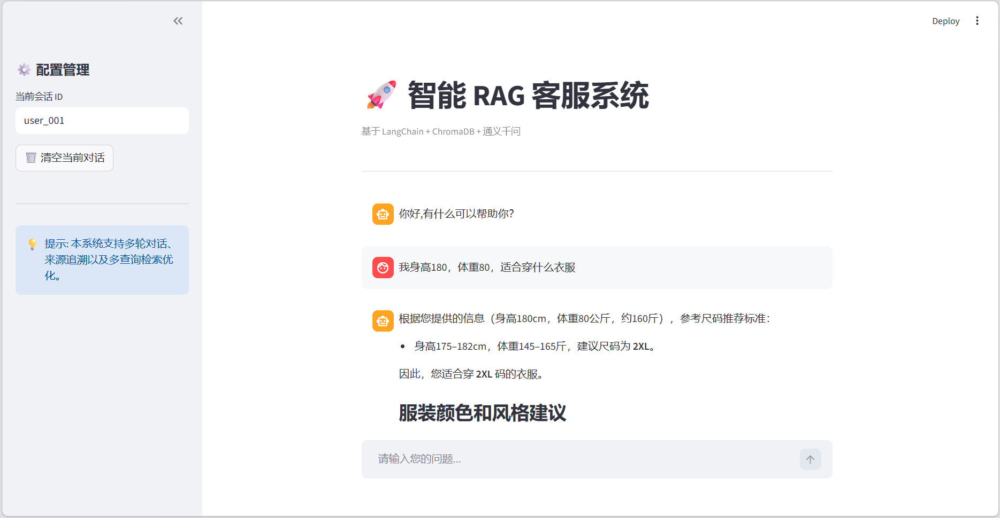
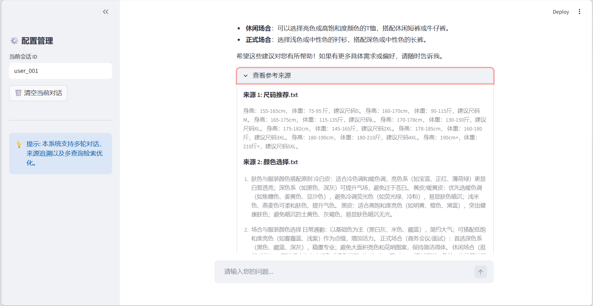

# 🚀 智能 RAG 客服系统

一个基于 **LangChain**、**ChromaDB** 和 **Streamlit** 构建的轻量级检索增强生成（RAG）问答系统。本项目支持将本地文档（TXT 等）导入向量库，并利用大语言模型（通义千问）结合知识库内容进行智能对话，支持多轮问答及来源追溯。

## 📸 项目演示

| 问答界面 | 来源追溯 |
| :---: | :---: |
|  |  |

## ✨ 项目特点

- **全流程 RAG 链路**：基于 LangChain 编排，覆盖“知识入库 -> 向量检索 -> LLM 生成”完整流程。
- **本地向量库**：使用 ChromaDB 作为本地持久化向量数据库，无需昂贵的云端存储。
- **高性能 Embedding**：采用 DashScope (阿里云百炼) 提供的 Embedding 模型完成高维向量转化。
- **智能对话模型**：集成通义千问 (Qwen) 大模型，生成精准且符合上下文的回答。
- **多轮会话管理**：支持基于 `session_id` 的多轮对话历史持久化，实现连贯的交互体验。
- **来源透明化**：问答结果支持“参考来源”展示，用户可点击展开查看召回的原文片段。
- **知识库自动化**：提供专门的上传管理页面，支持文档切分、MD5 去重及增量入库。

## 🛠️ 主要技术栈

- **核心框架**：[LangChain](https://github.com/langchain-ai/langchain)
- **前端界面**：[Streamlit](https://streamlit.io/)
- **向量数据库**：[Chroma](https://www.trychroma.com/)
- **模型支持**：[DashScope](https://help.aliyun.com/zh/dashscope/) (通义千问 / Qwen)
- **编程语言**：Python 3.9+

## 📂 项目结构

```text
RAG_program/
├── RAG/                     # 核心代码目录
│   ├── app_qa.py            # 🚀 智能问答主界面 (Streamlit)
│   ├── app_file_uploader.py # 📂 知识库文件上传与管理界面
│   ├── rag.py               # 🧠 RAG 问答链核心逻辑实现
│   ├── knowledge_base.py    # 📚 文档处理、切分与向量化入库
│   ├── vector_stores.py     # 🔍 向量库检索与封装
│   ├── config_data.py       # ⚙️ 全局配置文件 (模型、路径等)
│   ├── file_history_store.py# 💾 对话历史文件存储逻辑
│   ├── data/                # 📄 示例知识库文本数据
│   ├── chroma_db/           # 🗄️ ChromaDB 本地持久化目录
│   └── chat_history/        # 🗨️ 会话历史记录存储
├── images/                  # 🖼️ README 演示图片
└── README.md                # 📖 项目说明文档
```

## 🚀 快速开始

### 1. 环境准备

确保已安装 Python 3.9 或更高版本。

```bash
# 克隆项目 (如果有的话)
# git clone <project_url>
# cd RAG_program/RAG

# 安装依赖
pip install -r RAG/requirements.txt
```

### 2. 配置 API Key

本项目使用阿里云百炼相关模型，请先在 [阿里云百炼平台](https://bailian.console.aliyun.com/) 获取 API Key。

设置环境变量：

```bash
# Windows (CMD)
set DASHSCOPE_API_KEY=your_api_key_here

# Windows (PowerShell)
$env:DASHSCOPE_API_KEY="your_api_key_here"

# Linux / macOS
export DASHSCOPE_API_KEY="your_api_key_here"
```

### 3. 运行项目

#### 步骤 A：导入知识库 (可选，已有 data 目录)
```bash
cd RAG
streamlit run app_file_uploader.py
```
在界面中选择 `data/` 目录下的文件或上传新文件，完成向量化入库。

#### 步骤 B：启动智能问答
```bash
cd RAG
streamlit run app_qa.py
```

## 💡 配置说明

你可以通过修改 `RAG/config_data.py` 来调整系统参数：

- `persist_directory`: 向量库保存路径。
- `embedding_model_name`: 使用的 Embedding 模型 (默认 `text-embedding-v2`)。
- `chat_model_name`: 使用的 LLM 模型 (默认 `qwen-plus`)。
- `chunk_size` & `chunk_overlap`: 文本切分的长度和重叠度。

## 🌟 后续优化建议

- [ ] 支持 PDF、Word、Excel 等更多非结构化文档。
- [ ] 引入混合检索 (BM25 + Vector) 提升召回精度。
- [ ] 增加 Rerank 模型对检索结果进行重排序。
- [ ] 接入更丰富的 UI 组件及图表展示。
